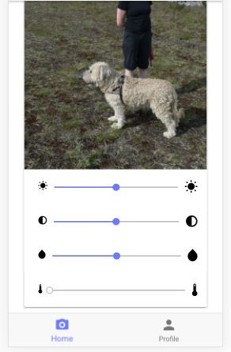

class: center, middle

# WBMA, Forms + Upload

## 4/2019

---

# Forms

### Task A: Create Upload Form 

1. Continue the previous exercise. Create a new git branch for these tasks.
1. Create a new page for the upload functionality
    - add input fields for 'title' (type=text), 'description' (textarea) and 'file' (type=file) to the template
    - accept only media files to file input
1. Add a button to HomePage to navigate to UploadPage ([navCtrl.push](https://ionicframework.com/docs/v3/api/navigation/NavController/))
1. When uploading a file to the API, you need to send [FormData](https://developer.mozilla.org/en-US/docs/Web/API/FormData/Using_FormData_Objects) 
    - in previous exercise you got field values with ngModel. When sending a file, you need to use $event (event object) and [FileReader](https://cordova.apache.org/docs/en/3.1.0/cordova/file/filereader/filereader.html)
    - in upload.ts create a method which is called by (change) event of the file input element. In the function log event to console to find out how to get the property that has the file. Save the value of that property to a variable of type File. 
    - create another method to upload the file. create new FormData object, add the file, title and description to the object and send it to the API using MediaProvider. Of course you need to create a new method to MediaProvider.
    - Add [LoadingController](https://ionicframework.com/docs/v3/api/components/loading/LoadingController/) to show a spinner
    - After image is uploaded go back to HomePage ([navCtrl.pop](https://ionicframework.com/docs/v3/api/navigation/NavController/))
        - wait 2 seconds before going back so that thumbnail is ready
        - hide spinner
        - when back in HomePage, refresh images (use ionViewDidEnter instead of ionViewDidLoad)
    - Add img element to UploadPage to show a preview of the selected media file
        - if media is audio or video use some default image
    - Example:
    
    
        
### Task B: Use CSS filters to adjust the image
1. Study [CSS filters](https://css-tricks.com/almanac/properties/f/filter/)
1. Add [ion-range](https://ionicframework.com/docs/v3/api/components/range/Range/) elements to change brightness, contrast, saturation and sepia CSS filters
1. Use [ngStyle](https://angular.io/api/common/NgStyle) to add filters to preview image
1. Save filter settings as tag when file is uploaded

1. If you have time, try to recreate [Instagram's Juno filter](https://tricky-photoshop.com/how-to-create-instagram-juno-effect-in-photoshop/)
    - instead of sepia filter, you need to create a [SVG-filter](https://css-tricks.com/gooey-effect/) to do the warming filter
